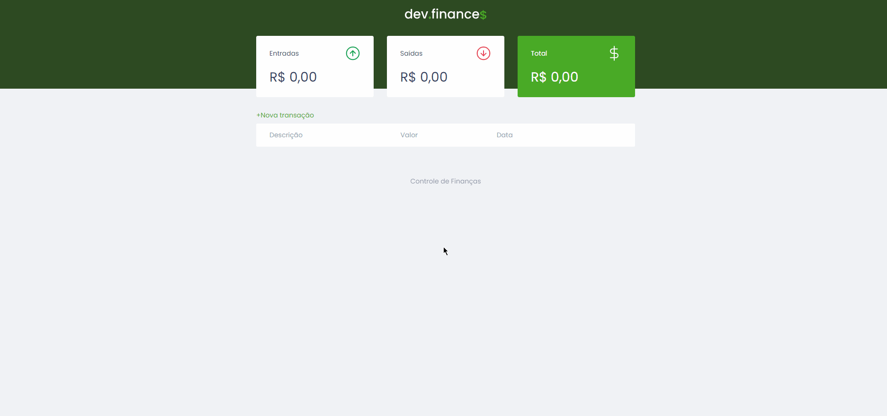

# Controle-Financeiro

Controle Financeiro

 <h1 align = "center" > <b>Controle Financeiro🤑</b> </h1>

    <h2>👀<b>Overview</b></h2> 
    

 
<h2>📄<u><b>Descrição:</b></u></h2>
 
    

        
Trabalho feito utilizando CSS, HTML e JavaScript, com a intenção de obter um meio de controle financeiro bem prçatico.

     

<h2>🚀<u><b>Tecnologias:</b></u></h2>
 

As seguintes tecnologias foram utilizados durante a construção deste projeto

 

- [HTML](https://developer.mozilla.org/en-US/docs/Web/HTML)
- [CSS](https://developer.mozilla.org/en-US/docs/Web/CSS)
- [JavaScript](https://developer.mozilla.org/en-US/docs/Web/JavaScript)
